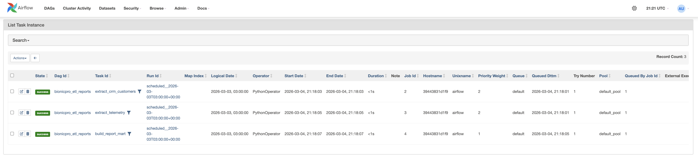

# Задание 1. Повышение безопасности системы

[Схема C4](Task1/C4_Containers_To_Be.drawio)

# Задание 2. Разработка сервиса отчётов

[Схема C4](Task2/C4_Containers_To_Be.drawio)

## Проверка

```bash
docker compose up -d --build
```

Проверяем, что скрипт нагенерил данных:

**CRM:**
```bash
docker compose exec crm_db psql -U crm_user -d crm_db -c "SELECT user_id, full_name FROM customers;"
```

**OLTP:**
```bash
docker compose exec oltp_db psql -U oltp_user -d oltp_db -c "SELECT user_id, count(*) FROM telemetry_events GROUP BY user_id;"
```

Если не нагенерил, то вызываем вручную:
```bash
docker compose run --rm data-generator
```

Ожидаемый вывод:
```
Connecting to CRM database...
Connecting to OLTP database...
--- Populating CRM ---
CRM: inserted 4 customers with prostheses.
--- Populating OLTP (telemetry) ---
OLTP: inserted ~36000 telemetry events.
Done!
```

Зайти на http://localhost:8082 (admin/admin) - выбрать DAG, у всех Tasks должен быть статус "success":




Ручной запуск DAG:
```bash
docker compose exec airflow airflow dags trigger bionicpro_etl_reports
```

Проверить статус:
```bash
docker compose exec airflow airflow dags list-runs -d bionicpro_etl_reports
```

Проверить витрину в ClickHouse

```bash
docker compose exec clickhouse clickhouse-client --query "SELECT user_id, prosthesis_id, report_date, total_events, avg_response_time_ms FROM bionicpro.report_mart ORDER BY report_date DESC LIMIT 10"
```

1. Открыть http://localhost:3000
2. Нажать **Login**, авторизоваться как `prothetic1`
3. Нажать **Download Report** - скачается CSV-файл с данными только этого пользователя 
4. Залогиниться как `prothetic2`, скачать отчет, в нём будут только данные `prothetic2`. Данные других пользователей недоступны.

# Задание 3. Снижение нагрузки на базу данных

## Проверка

1. Открыть http://localhost:3000
2. Войти как `prothetic1`
3. Нажать `Download Report` 
4. Браузер скачает CSV-файл через `CDN` (`localhost:8084`). В теле ответа будет "generated"
5. Нажать `Download Report` повторно. В теле ответа будет "cache"
6. Удалить кэш вручную:
   ```commandline
    curl -s http://localhost:8001/reports/cache -X DELETE
   ```
7. Скачать заново отчет. В теле ответа снова будет "generated"
8. Зайти на http://localhost:9001 (minioadmin/minioadmin). В бакете bionicpro-reports должны быть сгенерированные для пользователей отчеты.